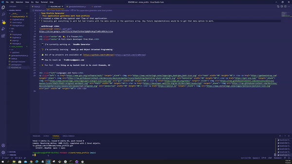

# Team Profile Generator
## This application generates work team profiles
* I created a video of the typical user flow of that application.
* I basically got everything to work but had trouble with the menu option in the questions array. Any future implementations would be to get that menu option to work. 

__walkthrough video__

<iframe src="https://drive.google.com/file/d/1pbBJgaVomXS3mJUJxDd-S6aRm5darEc_/preview" width="640" height="480"></iframe>

<h1 align="center">Hi 👋, I'm Tracee</h1>
<h3 align="center">A full-stack developer from Utah.</h3>

- 🔭 I’m currently working on **ReadMe Generator**

- 🌱 I’m currently learning **Node.js and Object Oriented Programming**

- 👨‍💻 All of my projects are available at [https://github.com/tra8brown](https://github.com/tra8brown)

- 📫 How to reach me **Tra8brown@gmail.com**

- ⚡ Fun fact **One thing on my bucket list is to visit Diomede, AK**

<h3 align="left">Languages and Tools:</h3>

       

